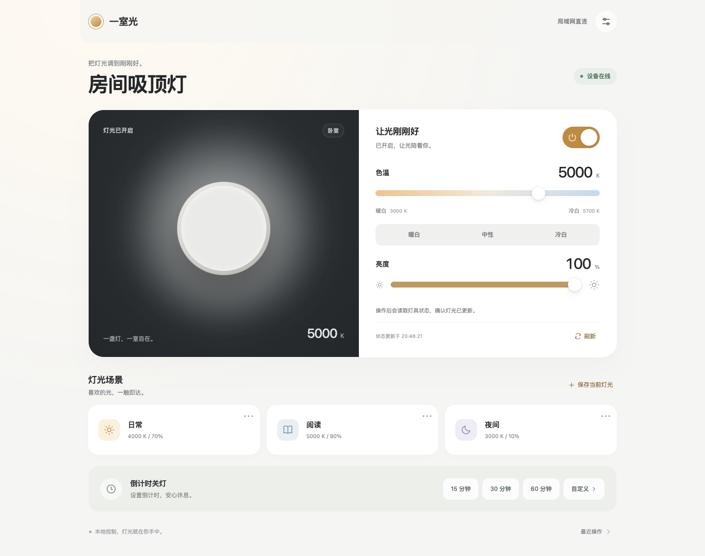

# 一室光 · OPPLE 灯光控制

一室光用于控制兼容的欧普灯具。你可以在手机或电脑浏览器里开关灯、调亮度和色温、保存常用灯光场景，以及设置倒计时关灯。

## 开始使用

1. 向服务提供者获取一室光的网址，并在手机或电脑浏览器中打开。
2. 如果页面显示登录窗口，按页面提示完成登录。使用 Pocket ID 的服务，选择“通过 Pocket ID 登录”，然后按提示使用通行密钥验证；如果页面要求访问口令，请向服务提供者获取口令。
3. 登录后等待页面读取灯具状态。设备在线时，页面会显示当前开关、亮度和色温。

## 控制灯光

1. 点击灯具卡片上的电源按钮即可开灯或关灯。
2. 拖动亮度滑块来调整明暗，拖动色温滑块或选择预设来调整光色。数值会随着拖动预览；松开滑块后服务才会提交调整。
3. 页面显示“下次开灯设置”时，灯具目前处于关闭状态。此时调整亮度或色温会保存偏好，不会自动开灯；下次开灯时会应用这些设置。
4. 点击刷新按钮可以立即重新读取灯具状态。通常页面也会自动更新。

色温以开尔文（K）表示：数值较低时光线偏暖黄，数值较高时光线偏冷白。可用范围取决于灯具型号；页面显示的范围适用于当前已配置的灯具。

## 保存和使用场景

1. 先把灯光调整到喜欢的亮度和色温。
2. 选择“保存当前灯光”，为场景命名并选择图标，然后保存。
3. 点击已保存的场景即可开灯并应用该场景。
4. 需要修改或删除场景时，打开场景卡片进行编辑。每盏灯最多保存 12 个场景。

## 设置倒计时关灯

1. 选择 15、30 或 60 分钟，或点击“自定义”输入分钟数。
2. 倒计时开始后，页面会显示剩余时间。
3. 如需提前停止，点击“取消倒计时”。

倒计时支持 1 至 1440 分钟。服务重启后仍会按原定截止时间继续；如果灯具离线，关灯操作会失败并显示状态，不会在恢复联网后突然补执行。

## 遇到问题时

- **页面显示设备离线：** 确认灯具已接通电源，墙壁开关处于开启状态，然后点刷新。关闭墙壁电源时，网络控制无法重新给灯具供电。
- **调整后没有变化：** 等待页面显示操作结果，再点刷新核对设备状态。如果仍失败，请确认该灯具型号支持页面所显示的功能，并联系服务提供者检查设备连接。
- **访问时要求登录或口令：** 使用服务提供者为你配置的登录方式。Pocket ID 登录使用通行密钥；访问口令请勿分享给无关人员。
- **场景没有按预期应用：** 检查场景中保存的亮度和色温；点击场景会开灯并应用这两个数值。

## 苹果快捷指令

服务提供者配置好 Pocket ID 的快捷指令客户端后，可以使用苹果“快捷指令”调用灯光 API，例如开关灯、设置色温和查询操作结果。客户端密钥属于访问凭据，请勿分享快捷指令或将其发布为公开模板。配置步骤见 [Pocket ID 与快捷指令说明](docs/POCKET_ID.md)。

## 项目信息

- [问题反馈与源代码](https://github.com/sdrpsps/opple-light)
- [开发与部署说明（uv）](docs/DEVELOPMENT.md)
- [Home Assistant OPPLE 集成](https://www.home-assistant.io/integrations/opple/)
- [许可证](LICENSE)与[第三方版权声明](THIRD_PARTY_NOTICES.txt)
