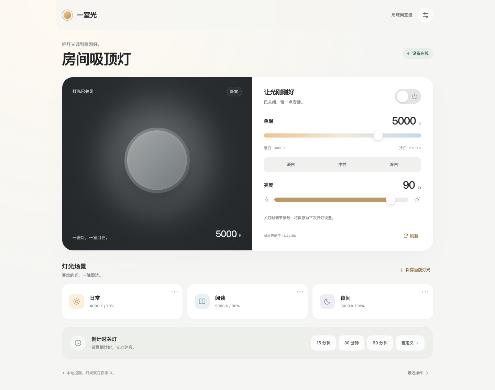

# 一室光 · OPPLE 本地灯光控制

一套独立运行的欧普灯控制服务。一个 Docker 容器提供手机网页和 HTTP API，通过局域网 UDP 直接控制灯具，不依赖 Home Assistant 或云账户。

默认设备：`192.168.111.6`，设备 ID：`bedroom`。



详细测试结果和硬件验证边界见 [验收记录](VALIDATION.md)。

## 已实现

- 开灯、关灯、3000–5700 K 色温、1–100% 亮度。
- 写入后回读确认，显示实际状态、离线提示和最后连接时间。
- 关灯时修改色温或亮度，保存为下次开灯设置。
- 日常、阅读、夜间场景；新增、编辑、删除自己的场景。
- 1–1440 分钟倒计时关灯，支持取消、重启恢复和过期限制。
- 手机与桌面网页，无外部字体、CDN 或前端构建依赖。
- 局域网免口令访问、HTTP API、操作记录、配置导出；可选口令模式。
- 完全隔离的演示模式，演示操作不会连接真实灯具。

每周定时、渐变、自动色温和 MQTT 属于后续扩展，本版本没有启用这些功能。

## 启动真实设备服务

默认方案是**原生 Linux / 支持 host 网络的 NAS 上的单容器直连**。容器内部已包含 OPPLE UDP 协议驱动，直接与 `192.168.111.6:55001` 通信；无需 Home Assistant、米家、独立转发进程或额外网关。宿主机必须能够访问灯具所在的局域网。

`compose.yaml` 使用 `network_mode: host`，没有转发环境变量，也不启动任何辅助容器。即使本地旧 `.env` 中残留转发设置，默认部署也不会注入它们。原生 Linux 的 host 网络共享宿主机网络命名空间，避免容器 NAT；见 [Docker 官方说明](https://docs.docker.com/engine/network/drivers/host/)。已在内网 Debian 13（192.168.111.27）完成容器直连灯具的连续读取验证：在线、关灯、90% 亮度、5000 K。其他 Linux/NAS 环境仍需单独验收。

在本项目目录运行：

```sh
docker compose up -d --build
docker compose ps
```

默认 HTTP 端口固定为 8080，host 网络不使用端口映射；`OPPLE_PORT` 和 `OPPLE_BIND_IP` 仅对可选的 macOS 兼容配置生效。

**当前 Mac / OrbStack 的限制：** 宿主机读取灯具成功，容器 bridge 和 host 网络直连均超时；尚未通过抓包确定唯一原因。把转发代码搬进同一容器不会消除网络边界。目前没有验证成功的 Mac 单容器无转发方案。2026-10-04 已按用户要求关停真实服务、演示服务和宿主机转发，保留数据，没有重新启动。

旧 macOS 兼容方案作为可选配置保留在 `compose.macos-relay.yaml`，不属于默认部署。只有明确需要此兼容方式时才运行 `python3 start-macos.py`；它会启动宿主机转发。原有 `启动一室光.command` 同样会启用此兼容方式。停止它：

```sh
docker compose -f compose.macos-relay.yaml down
python3 start-macos.py --stop-relay
```

本机打开 `http://localhost:8080`。手机访问 `http://<宿主机局域网IP>:8080`。灯具 IP 和宿主机 IP 是两个不同的地址。

本项目默认 `OPPLE_AUTH_DISABLED=1`，网页和 HTTP API 均免口令，打开即可使用。免口令模式隐藏登录与退出登录入口，不读取或生成访问口令；已有数据卷中的旧口令文件可保留，不影响访问。

需要恢复口令模式时，在 `.env` 设置 `OPPLE_AUTH_DISABLED=0`，运行 `docker compose up -d` 重建容器配置。口令模式可设置 `OPPLE_TOKEN`，或从数据卷生成并读取：`docker compose exec light cat /data/access-token`。

服务启动或重启只查询状态，不会自动开灯。若数据中存在仍有效的倒计时，该倒计时会按原截止时间执行。

## 已部署的内网 Debian

- 地址：http://192.168.111.27:8080/
- 目录：`/home/sunny/opple-light-test`
- 单个容器：`opple-light-light-1`，host 网络，无 UDP 转发。
- Debian 13 x86_64，Docker 26.1.5，Compose 2.26.1。
- 连续三次真实灯具状态读取成功，健康检查通过；此次没有改变灯具状态。
- Mac 原真实服务、演示服务和转发进程均保持关停。

Debian 已启用免口令访问。停止或重新启动：

```sh
cd /home/sunny/opple-light-test
sudo docker-compose down
sudo docker-compose up -d --no-build
```

本次 Docker Hub 访问超时，使用 `Dockerfile.debian-test` 经 `docker.m.daocloud.io` 下载 Python 基础镜像构建，运行时没有镜像代理依赖。需要在该 Debian 重建时使用：

```sh
sudo docker build -f Dockerfile.debian-test -t opple-local:1.0.0 .
sudo docker-compose up -d --no-build
```

状态证据见 [Debian 验证数据](debian-validation.json)。

## 演示界面

```sh
docker compose -f compose.demo.yaml up -d --build
```

打开 `http://localhost:8086`。演示服务只监听本机，免登录，数据与真实设备服务分开保存。页面始终标注“演示模式”。它使用模拟设备，不会创建灯具 UDP socket。

停止演示：

```sh
docker compose -f compose.demo.yaml down
```

## 配置设备

编辑 `config/config.yaml`：

```yaml
name: 一室光
mode: real
poll_interval_seconds: 10
command_ttl_seconds: 20
timezone: Asia/Shanghai
lights:
  - id: bedroom
    name: 房间吸顶灯
    host: 192.168.111.6
    min_kelvin: 3000
    max_kelvin: 5700
    default_kelvin: 4000
    default_brightness: 70
```

修改后运行 `docker compose restart light`。`default_kelvin` 和 `default_brightness` 是默认配置与演示初始值，不会在真实灯具启动时强行写入。

色温范围默认沿用 Home Assistant OPPLE 集成的 3000–5700 K。底层库支持的数值范围不代表每款灯具都支持，需要实测后再扩大。可添加更多设备，每盏灯有独立队列和状态，网页显示设备选择器。建议在路由器上保留灯具的 IP 地址。

## 控制行为

| 情况 | 行为 |
| --- | --- |
| 开灯时调色温或亮度 | 写入设备，再读取并确认 |
| 关灯时调色温或亮度 | 保存“下次开灯设置”，不触发开灯 |
| 点击开灯 | 开灯并应用保存的下次设置；成功后清除暂存设置 |
| 点击场景 | 开灯并应用场景中的色温和亮度 |
| 灯具离线 | 普通命令失败，不等待恢复后重放 |
| 控制部分成功 | 保留实际回读状态，并报告操作失败 |
| 倒计时期间重启 | 保留原截止时间，不从头计时 |
| 重启时倒计时已过期 | 仅在截止后 120 秒内尝试补执行；超过窗口则标记过期 |
| 倒计时执行时设备离线 | 报告失败，不无限重试 |
| 重启前未完成的普通操作 | 标记中断，不重放 |

网页滑块在松手后提交；执行期间再次调节，只保留最新待提交参数。后台对同一设备串行执行读写。底层是同步协议，长时间等待设备不会阻塞网页服务。状态读取遇到一次超时时，会间隔 200 ms 重试一次；这只重试查询，不重放灯光修改。操作过期限制针对尚未开始的排队命令，已开始的设备操作会完成其有界的查询与重试。

关闭墙壁电源后，灯具无法联网；这时网页显示离线，不能通过软件恢复供电。外部遥控器改变灯光后，网页在下一次轮询时更新。

## HTTP API

除 `/health/live`、会话查询和登录外，接口需要认证。脚本使用请求头 `Authorization: Bearer <访问口令>`；网页使用 HttpOnly 会话 Cookie。

| 方法与路径 | 用途 |
| --- | --- |
| `GET /api/v1/status` | 模式、服务时间、所有灯具状态 |
| `GET /api/v1/lights` | 灯具列表 |
| `GET /api/v1/lights/bedroom` | 状态、能力范围、暂存参数、倒计时 |
| `PATCH /api/v1/lights/bedroom/state` | 设置开关、色温、亮度 |
| `POST /api/v1/lights/bedroom/refresh` | 请求主动读取状态 |
| `GET /api/v1/operations/{id}` | 查询操作结果 |
| `GET /api/v1/scenes` | 场景列表 |
| `POST /api/v1/lights/bedroom/scenes` | 新建场景 |
| `PUT /api/v1/scenes/{id}` | 修改场景 |
| `DELETE /api/v1/scenes/{id}` | 删除场景 |
| `POST /api/v1/scenes/{id}/apply` | 应用场景 |
| `PUT /api/v1/lights/bedroom/timer` | 设置或替换倒计时 |
| `DELETE /api/v1/lights/bedroom/timer` | 取消倒计时 |
| `GET /api/v1/events` | 最近操作记录 |
| `GET /api/v1/backup` | 导出非秘密配置、场景与暂存参数 |

以下是请求示例；只有在你希望修改灯光时运行：

```sh
export OPPLE_TOKEN='你的访问口令'
curl -X PATCH 'http://localhost:8080/api/v1/lights/bedroom/state' \
  -H "Authorization: Bearer $OPPLE_TOKEN" \
  -H 'Content-Type: application/json' \
  -d '{"power":true,"color_temperature_kelvin":4000,"brightness_percent":70}'
```

返回 HTTP 202 和 `operation_id`（响应的 `id` 字段）。202 表示接受操作，完成结果需查询：

```sh
curl 'http://localhost:8080/api/v1/operations/替换为响应中的id' \
  -H "Authorization: Bearer $OPPLE_TOKEN"
```

操作状态：`pending`、`running`、`confirmed`、`staged`、`failed`、`expired`、`cancelled`。`staged` 表示关灯时已保存参数，并未写入灯具。

设置倒计时的请求体为 `{"minutes":30}`。场景请求体示例：

```json
{"name":"睡前阅读","color_temperature_kelvin":3300,"brightness_percent":25,"icon":"book"}
```

`icon` 支持 `sun`、`book`、`moon`、`spark`；每盏灯最多 12 个场景。数值必须是 JSON 整数，开关必须是 JSON 布尔值。

## 数据与维护

真实服务的数据卷为 `opple-light_light-data`，内部包含 SQLite 数据库和口令。`docker compose down` 保留数据；不要在需要保留数据时使用 `down -v`。

网页“设置与记录”可以导出 JSON，包含配置、场景和下次开灯设置，不包含口令、会话、历史操作或正在运行的倒计时。JSON 可用于迁移配置；完整恢复（含倒计时和登录口令）需要备份数据卷。

查看日志和更新：

```sh
docker compose logs --tail=100 light
docker compose up -d --build
```

健康检查仅检查服务是否正常，灯具离线不会导致容器无限重启。镜像以非 root 用户运行，容器根文件系统只读，不需要 privileged。运行时完全使用本地资源；构建阶段需要下载 Python 基础镜像和依赖。

默认 Linux host 网络下如读取超时，检查供电、IP、宿主机路由和防火墙。灯具发现及控制端口均为 UDP 55001，还需要允许灯具向应用 socket 的接收端口返回数据。

旧 macOS 转发方案已完成物理开关、色温和亮度验证；Debian 13 单容器直连已验证连续三次真实状态读取，本次没有发送状态写入。其他 Linux/NAS 环境仍需单独验收。
## 开发与测试

Python 3.12：

```sh
python3 -m venv .venv
.venv/bin/pip install -r requirements.txt -r requirements-dev.txt
OPPLE_MODE=demo OPPLE_DEMO_OPEN=1 OPPLE_DATA=./data-demo \
  .venv/bin/uvicorn app.main:app --host 127.0.0.1 --port 8086
```

在另一个终端运行测试：

```sh
.venv/bin/python -m pytest -q
```

浏览器测试需要 Node.js 和 Playwright，且只允许对演示服务写入：

```sh
npm install --no-save playwright
npx playwright install chromium
node tests/browser.cjs
```

也可用 `PLAYWRIGHT_CHANNEL=chrome node tests/browser.cjs` 使用已安装的 Chrome。测试覆盖真实的 60 秒演示倒计时、离线恢复、场景增删改、配置下载，以及 320/390/768/1440 像素布局。测试不会控制真实灯具。

## 技术来源与兼容性

- [Home Assistant OPPLE 集成](https://www.home-assistant.io/integrations/opple/)
- [pyoppleio-legacy](https://github.com/tinysnake/python-oppleio-legacy)，MIT，固定使用 1.0.8。

该库适用于旧版 OPPLE Wi-Fi 固件。本项目没有对新版固件做逆向，也没有更改灯具固件。适配层保留原协议，增加了回复来源校验和接收循环总时限。

本项目采用 MIT 许可证。


## 界面与动画

按 apple-design 技能更新：系统字体、米白与石墨色层次、暖金色开关、44px 滑杆触摸区域、半透明固定顶栏和手机底部弹窗。按钮与色温预设采用可重定向的弹簧动画；手机弹窗支持带释放速度的下拉关闭，中途可重新拖动。支持 Escape、焦点返回，以及系统减少动态效果、减少透明度和增加对比度偏好。没有新增外部字体、CDN 或动画依赖。

动画和布局只读检查：`PLAYWRIGHT_CHANNEL=chrome node tests/motion.cjs`；可通过 TEST_URL 和 TEST_ARTIFACTS 指定验证地址与截图目录。测试禁止所有 API 写请求，可用于实际部署页面的动画验收。
